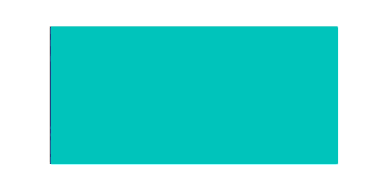

.. Lizzy documentation master file, created by
   sphinx-quickstart on Sat Mar 29 23:21:30 2025.
   You can adapt this file completely to your liking, but it should at least
   contain the root `toctree` directive.

Welcome to Lizzy
================

Lizzy is a Liquid Composite Molding (LCM) simulation package written in Python.
Is is designed to simulate resin infusion processes that are used in the manufacturing of composites parts, like Resin Transfer Molding (RTM) or Liquid Resin Infusion (LRI). Lizzy's APIs allow users to have total control on its functionalities.

Lizzy uses the FE/CV method to solve the macroscopic Darcy's law and simulate the infusion of a porous material by a viscous fluid.
The name "Lizzy" was inspired by the character of Elizabeth Bennet, companion of Mr Darcy in Jane Austen's novel "Pride and Prejudice".

.. toctree::
   :hidden:

   installation/installation
   tutorials/tutorials
   user_guide/using_lizzy
   api_reference/api_reference_index

.. raw:: html

   

     <a class="doc-card" href="installation/installation.html">
       <h3>Installation</h3>
       
Instructions on how to install Lizzy.

     </a>

     <a class="doc-card" href="tutorials/tutorials.html">
       <h3>Tutorials</h3>
       
A few tutorials to learn the basics of Lizzy.

     </a>

     <a class="doc-card" href="user_guide/using_lizzy.html">
       <h3>User Guide</h3>
       
Learn how to run simulations with Lizzy.

     </a>

     <a class="doc-card" href="api_reference/api_reference_index.html">
       <h3>API Reference</h3>
       
In-depth API documentation (under construction).

     </a>

   

   
Features
--------

Lizzy aims to be a tool for research on resin infusion processes. The solver is built as a Python package, that can be used within any Python script.
Its object-oriented architecture gives full control over all aspects of the simulation.
Some of the features of Lizzy are:

- Flexible Python scripting API.
- Import of external meshes.
- Support for any number of material regions and anisotropic permeability.
- Design complex infusion strategies using virtual sensors and dynamic boundary conditions.

Current limitations
-------------------

As an evolving project, Lizzy still has some limitations at the moment:

- Currently supports only triangle meshes (no 3D elements).
- Limited boundary condition types currently available.

Consult our :ref:`Roadmap <roadmap>` for planned feature implementations.

.. toctree::
   :hidden:

   roadmap

.. note::

   This project is still in early development and documentation may be incomplete. Version 1.0 is scheduled for release in early 2026. Stay tuned!
