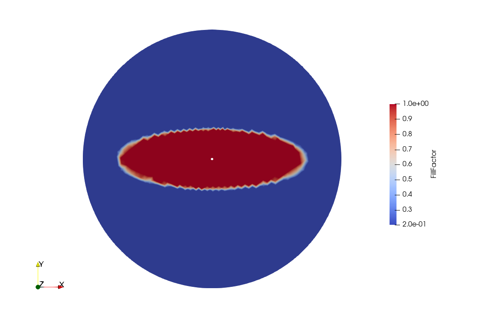
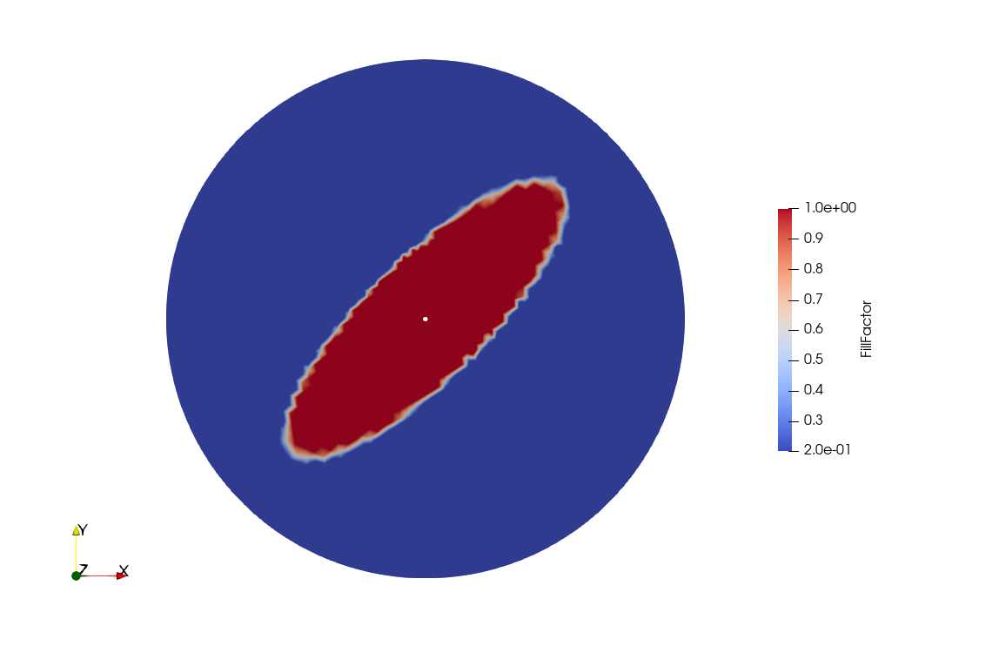

.. _anisotropy:

Anisotropy
==========

In this tutorial we will explore two key concepts: material anisotropy and material orientation. To do so, we will simulate the classic *Radial Infusion* experiment, with an anisotropic twist. Much of the workflow is identical to the :ref:`channel_flow` example, so all topics already encountered won't be repeated here.

Copy the mesh file
------------------

Create a folder in a preferred location and copy the :download:`mesh file <../../../examples/meshes/Radial.msh>` in the new directory.
The mesh contains 3 domain tags ("physical groups" in msh format): *inner_rim*, *outer_rim*, *domain*.

Import and parameters
---------------------

The first steps are to import Lizzy, create a LizzyModel, read the mesh file and assign some process parameters. This setup is identical to the :ref:`channel_flow` example.

.. code-block::

    import lizzy as liz

    model = liz.LizzyModel()
    model.read_mesh_file("Radial.msh")
    model.assign_simulation_parameters(mu=0.1, wo_delta_time=100)

Creating an oriented anisotropic material
-----------------------------------------

It is possible to assign an anisotropic permeability to a ``PorousMaterial`` by passing different permeability values at instantiation. When a ``PorousMaterial`` is created, the  permeability is assigned by passing the principal components :math:`k_1, k_2, k_3` which are aligned with the local orthonormal basis of the material :math:`\hat{\mathbf{e}}_1, \hat{\mathbf{e}}_2, \hat{\mathbf{e}}_3` (which is not defined in global coordinates). This operation populates a second-rank permeability tensor :math:`\mathbf{K}_{mat}` expressed in material principal components. To perform the simulation we must provide some information on how to map the material principal directions onto the geometry global coordinates. We do this by creating a ``Rosette`` object:

.. code-block::

    rosette = liz.Rosette((1,0,0))

The constructor of ``Rosette`` can take different forms of arguments. The simplest way to instantiate a Rosette is by passing a 3D vector, in global :math:`x, y, z` components, that indicates the global direction of the first principal permeability :math:`k_1`.
The next step is to create one anisotropic material and assign it to the domain:

.. code-block::

    model.create_material(1E-10, 1E-11, 1E-10, 0.5, 1.0, "aniso_material")
    model.assign_material("aniso_material", "domain", rosette)

Note the factor 10 difference between :math:`k_1` and :math:`k_2`. Lastly, we can assign the material and the rosette to a given domain patch - in this case, only the *domain* tag is present in the mesh.
When we pass a rosette to ``assign_materials``, a local rosette is calculated for each element in the mesh following this procedure:

    * the rosette vector is projected onto the element along the element normal to obtain the local principal orientation :math:`\mathbf{e}^{el}_1`
    * the direction :math:`\mathbf{e}^{el}_3` is assigned as the element normal
    * the direction :math:`\mathbf{e}^{el}_2` is obtained as :math:`\mathbf{e}^{el}_1 \times \mathbf{e}^{el}_3`.

Once the element projected rosette is calculated, the local transformation :math:`\mathbf{K}_{mat} \rightarrow \mathbf{K}_{el}` is calculated and applied to the material permeability to obtain the element permeability tensor :math:`\mathbf{K}_{el}` expressed in global basis.

.. note::

    When we don't create and assign a ``Rosette`` to the material manager, a default rosette aligned with global axes is used. This is usually the preferred practice in case of purely isotropic materials, like in the :ref:`channel_flow` tutorial.

Completing the script
---------------------

We can now conclude the script by assigning boundary conditions to the *inner_rim* and solving. These steps are nearly identical to the :ref:`channel_flow` example:

.. code-block::

    model.create_inlet(1E+05, "inner_inlet")
    model.assign_inlet("inner_inlet", "inner_rim")

    # solve
    model.initialise_solver()
    solution = model.solve()

    # write results
    model.save_results(solution, "Radial")

The full script
---------------

.. code-block::

    import lizzy as liz

    model = liz.LizzyModel()
    model.read_mesh_file("Radial.msh")
    model.assign_simulation_parameters(mu=0.1, wo_delta_time=100)

    rosette = liz.Rosette((1,0,0))
    model.create_material(1E-10, 1E-11, 1E-10, 0.5, 1.0, "aniso_material")
    model.assign_material("aniso_material", "domain", rosette)

    model.create_inlet(1E+05, "inner_inlet")
    model.assign_inlet("inner_inlet", "inner_rim")

    model.initialise_solver()
    solution = model.solve()

    model.save_results(solution, "Radial")

Solution visualisation
----------------------

Load up the file ``Radial_RES.xdmf`` into Paraview to visualise the results:

The fill pattern shows the typical ellipse-shaped flow front that we get from this experiment. The ellipse axes are aligned with the principal directions of permeability. In this case, since the vector (1,0,0) was used to orient the rosette, the major axis is aligned with the global :math:`x` axis and the minor axis, endorsing a permeability one order of magnitude lower, is aligned with the global :math:`y` axis.

A different orientation
-----------------------

Suppose now that our material has a principal permeability direction oriented at :math:`45^\circ` around the :math:`z` axis from the global :math:`x` axis. We can prescribe this new orientation simply by editing the rosette assigned to the domain:

.. code-block::

    rosette_45 = liz.Rosette((1,1,0))
    ...
    model.assign_material("aniso_material", "domain", rosette_45)

The vector (1,1,0) lies on the :math:`x`-:math:`y` plane and describes an orientation at :math:`45^\circ` from :math:`x`. This will set the principal permeability value :math:`k_1` along the new orientation vector.

.. note::

    The vector passed to the ``Rosette`` constructor doesn't need to be normalised. Only its direction matters.

The rest of the script remains unchanged. This time, we obtain a different result:

We can see that the flow front progression is identical but the ellipse axes have rotated by :math:`45^\circ`, as expected.