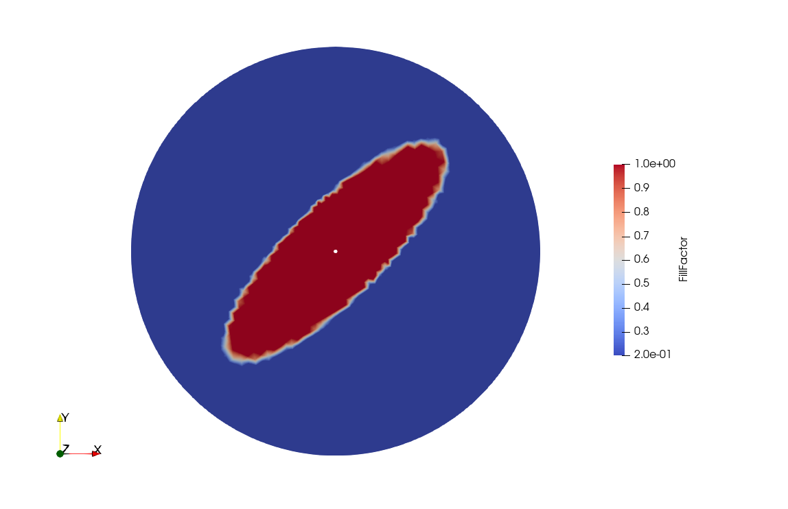

.. _anisotropy:
.. py:currentmodule:: lizzy

Anisotropy
==========

In this tutorial we will explore two key concepts: material anisotropy and material orientation. To do so, we will simulate the classic *Radial Infusion* experiment, with an anisotropic twist: we will assign a strongly anisotropic material that has its principal premeability direction :math:`k_1` oriented at :math:`45^\circ` around the :math:`z` axis from the global :math:`x` axis. 

All files used in this tutorial are available in the `tutorials/anisotropy <../../../tutorials/anisotropy/>`_ folder. We recommend you download the :download:`mesh alone <../../../tutorials/anisotropy/Anisotropy.msh>` and create the script yourself following the tutorial.

.. note::

    If you have not yet completed the :ref:`channel_flow` tutorial, we advise to do that first because here we will not cover in detail the steps that were already introduced.

The mesh
--------

The mesh represents a circular domain with an inner radius of 0.005 m and an outer radius of 0.5 m. The mesh contains 3 domain tags:

* *inner_rim*: line tag assigned to the inner edge of the domain
* *outer_rim*: line tag assigned to the outer edge of the domain
* *domain*: elements tag assigned to the whole domain

Preparing the working folder
----------------------------

Follow the same steps described in :ref:`channel_flow` to set up the working folder and copy the mesh file into it. Create a new Python script — in this example we name it ``anisotropy.py``.

Setting up the model
--------------------

This section is largely identical to the :ref:`channel_flow` and :ref:`racetracking` examples, so see those for details.

.. code-block:: python

    import lizzy

    import logging
    logging.basicConfig(level=logging.INFO)

    model = lizzy.LizzyModel()
    model.read_mesh_file("Anisotropy.msh")  
    model.set_simulation_parameters(output_interval=60, progress_bar=True)

    model.create_resin("resin_01", 0.1)
    model.assign_resin("resin_01")

Creating an oriented anisotropic material
-----------------------------------------

It is possible to assign an anisotropic permeability to a ``PorousMaterial`` by passing different permeability values at instantiation. When a ``PorousMaterial`` is created, the  permeability is assigned by passing the principal components :math:`k_1, k_2, k_3` which are aligned with the local orthonormal basis of the material :math:`\hat{\mathbf{e}}_1, \hat{\mathbf{e}}_2, \hat{\mathbf{e}}_3` (which is not defined in global coordinates). This operation populates a second-rank permeability tensor :math:`\mathbf{K}_{mat}` expressed in material principal components. However, if these values are differnt (anisotropic material), we must provide some information on how to map the material principal directions onto the geometry global coordinates. We do this by creating a named :class:`Rosette`, and then passing it to the :meth:`assign_material` method.

.. code-block::

    model.create_rosette("rosette", (1,1,0))
    model.create_material("aniso_material", (1E-10, 1E-11, 1E-10), 0.5, 0.005)
    model.assign_material("aniso_material", 'domain', "rosette")

Note the factor 10 difference between :math:`k_1` and :math:`k_2`. The :meth:`create_rosette` method can take different forms of arguments. The simplest way to instantiate a Rosette is by passing a 3D vector, in global :math:`x, y, z` components, that indicates the global direction of the first principal permeability :math:`k_1`.
The vector (1,1,0) lies on the :math:`x`-:math:`y` plane and describes an orientation at :math:`45^\circ` from :math:`x`. This will set the principal permeability value :math:`k_1` along the new orientation vector.
When we pass a rosette to :meth:`assign_material`, a local rosette is calculated for each element in the mesh following this procedure:

    * the rosette vector is projected onto the element along the element normal to obtain the local principal orientation :math:`\mathbf{e}^{el}_1`
    * the direction :math:`\mathbf{e}^{el}_3` is assigned as the element normal
    * the direction :math:`\mathbf{e}^{el}_2` is obtained as :math:`\mathbf{e}^{el}_1 \times \mathbf{e}^{el}_3`.

Once the element projected rosette is calculated, the local transformation :math:`\mathbf{K}_{mat} \rightarrow \mathbf{K}_{el}` is calculated and applied to the material permeability to obtain the element permeability tensor :math:`\mathbf{K}_{el}` expressed in global basis.

.. note::

    The vector passed to the ``Rosette`` constructor doesn't need to be normalised. Only its direction matters.

.. note::

    When we don't create and assign a rosette, a default one aligned with global axes is used. This is usually the preferred practice in case of purely isotropic materials, like in the :ref:`channel_flow` tutorial.

Completing the script
---------------------

We can now conclude the script by assigning boundary conditions to the *inner_rim* and solving. These steps are nearly identical to the :ref:`channel_flow` and :ref:`racetracking` examples:

.. code-block::

    model.create_pressure_inlet("inner_inlet", 1E+05)
    model.assign_inlet("inner_inlet", "inner_rim")

    model.create_vent("outer_vent", 0.0)
    model.assign_vent("outer_vent", "outer_rim")

    model.initialise_solver()
    model.solve()

    model.save_results()

The full script
---------------

.. code-block::

    import lizzy

    import logging
    logging.basicConfig(level=logging.INFO)

    model = lizzy.LizzyModel()
    model.read_mesh_file("Anisotropy.msh")
    model.set_simulation_parameters(output_interval=60, progress_bar=True)

    model.create_resin("resin", 0.1)
    model.assign_resin("resin")

    model.create_rosette("rosette", (1,1,0))
    model.create_material("aniso_material", (1E-10, 1E-11, 1E-10), 0.5, 0.005)
    model.assign_material("aniso_material", 'domain', "rosette")

    model.create_pressure_inlet("inner_inlet", 1E+05)
    model.assign_inlet("inner_inlet", "inner_rim")

    model.create_vent("outer_vent", 0.0)
    model.assign_vent("outer_vent", "outer_rim")

    model.initialise_solver()
    model.solve()

    model.save_results()

Solution visualisation
----------------------

Load up the file ``Anisotropy_RES.xdmf`` into Paraview (use **`Xdmf3 Reader S`**) to visualise the results:

The fill pattern shows the typical ellipse-shaped flow front that we get from this experiment. The ellipse main axis is aligned with the (1,1,0) vector used to orient the rosette.