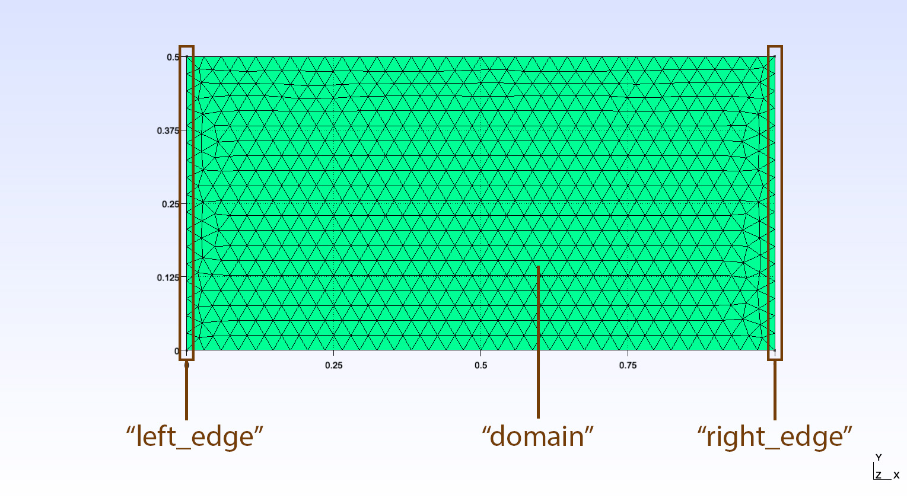
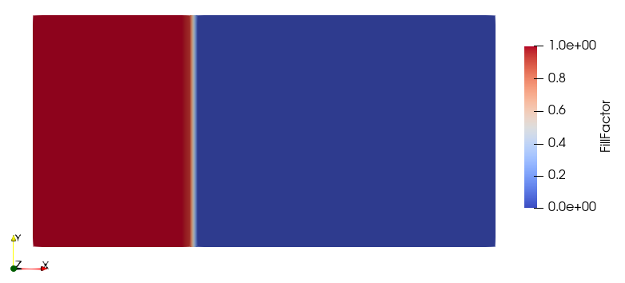

.. _channel_flow:
.. py:currentmodule:: lizzy

Channel Flow
============

This case demonstrates a minimal implementation of the solver. We will use Lizzy to simulate the filling of an isotropic rectangular panel, prescribing a one-dimensional flow. This classical infusion scenario is known as the Channel Flow experiment :cite:`weitzenbock1999`.

All files used in this tutorial are available in the `tutorials/channel_flow <../../../tutorials/channel_flow/>`_ folder. We recommend you download the :download:`mesh alone <../../../tutorials/channel_flow/ChannelFlow.msh>` and create the script yourself following the tutorial.

Preparing the working folder
----------------------------

Create a new folder in a preferred location and name it something descriptive of the infusion scenarion, like *channel_flow* or similar. We will refer to this folder as the *working folder* and the entire Lizzy workflow will be run inside here.
Copy the mesh file into the working folder. Create a new python script in the working folder. This will be the only python script we will need. In this example, the file is named `channel_flow.py`, but any name will do.

The mesh
--------

The mesh contains 3 domain tags ("physical groups" in msh format):

* *left_edge*: line tag assigned to the left edge of the mesh
* *right_edge*: line tag assigned to the right edge of the mesh
* *domain*: elements tag assigned to all elements in the mesh

These tags will be used to identify regions of the mesh for assignment of material properties and boundary conditions.

Importing Lizzy
----------------

In the first line of the script, let's import Lizzy by:

.. code-block:: python

    import lizzy as liz

Setting up logging
------------------

Lizzy uses the standard Python :mod:`logging` module to log messages. By default, nothing will output to console (as recommended practice when using the logging moule). To get some information at runtime, let's set up the logger to the INFO level:

.. code-block:: python

    import logging
    logging.basicConfig(level=logging.INFO)

Creating the Lizzy model
------------------------

Every simulation model in Lizzy is defined using the :class:`LizzyModel` class. This is the main class of the solver and provides all APIs necessary to fully define a simulation scenario.

The first expression in any Lizzy script is to create the LizzyModel that will be used in the simulation:

.. code-block::

    model = liz.LizzyModel()

From now on, we will use this :class:`LizzyModel` object to access all the relevant APIs.

Reading the mesh file
---------------------

Let's read the mesh file that we have copied:

.. code-block::

    model.read_mesh_file("ChannelFlow.msh")

Make sure that the path given points to the mesh file that we have copied in the folder.
In this example, both the script and the mesh are in the working folder. If your folder structure is different, adjust the mesh path accordingly.

Setting simulation parameters
-----------------------------

Now that the mesh is read, we need to define a few settings. We can do so using the :meth:`~lizzy.LizzyModel.set_simulation_parameters` method. We will set the to write a solution state every 10 seconds in the results file, and we will activate a progress bar that will show us solution progress at runtime:

.. code-block:: python

    model.set_simulation_parameters(output_interval=30, progress_bar=True)

.. note::

    There is no particular order in the script as where the :meth:`~lizzy.LizzyModel.set_simulation_parameters` method should be called, as long as it is done *before* the solver is initialised by the :meth:`~lizzy.LizzyModel.initialise_solver` method (further on). Failure to do so, or omitting the call entirely, will result in running the simulation with default values.

Creating materials
------------------

Next, define the resin (fluid) to be used in the simulation:

.. code-block:: python

    model.create_resin("resin", viscosity=0.1)
    model.assign_resin("resin")

The :meth:`~lizzy.LizzyModel.create_resin` method takes a name and a dynamic viscosity value [Pa.s]. The resin must be assigned to the model using :meth:`~lizzy.LizzyModel.assign_resin`.

Now we can define the properties of the material in the mesh and assign it to a mesh domain:

.. code-block:: python

    model.create_material("test_material", (1E-10, 1E-10, 1E-10), 0.5, 1.0)
    model.assign_material("test_material", 'domain')

The method :meth:`~lizzy.LizzyModel.create_material` instantiates a ``PorousMaterial`` object which is stored in the model. The arguments of :meth:`~lizzy.LizzyModel.create_material` are:

* ``name`` (str): the name assigned to the material, used to identify it for later assignment.
* ``k_vals`` (tuple[float, float, float]): permeability values :math:`(k_1, k_2, k_3)` in principal directions [m²].
* ``porosity`` (float): the fraction of total material volume not occupied by solid material (1 - Vf).
* ``thickness`` (float): the thickness of the material in the out-of-plane direction [m].

Note that no material orientation was defined. This is ok because the material declared is isotropic. Behind the scenes, Lizzy assigns a default rosette aligned with the global x, y, z axes. Local material orientations and zone-specific rosettes will be detailed in more advanced examples.

.. note::

    Each material tag present in the mesh must be assigned a material, otherwise initialisation will raise an error.

Boundary conditions
-------------------

Next, we will create some boundary conditions. In this example we will create a pressure inlet on the left edge of the mesh.
Inlets are created with a name and a pressure value, then assigned to a mesh boundary:

.. code-block::

    model.create_pressure_inlet("inlet_left", 1E+05)
    model.assign_inlet("inlet_left", "left_edge")

The :meth:`~lizzy.LizzyModel.create_pressure_inlet` method takes the inlet name and the prescribed pressure value [Pa].

We can also create a vent gate where perfect vacuum is prescribed (p=0 Pa) on the right edge of the mesh:

.. code-block::

    model.create_vent("vent_right", 0.0)
    model.assign_vent("vent_right", "right_edge")

Creating a vent is not strictly necessary (if no vent is defined, the solver will automatically assign a pressure p=0 Pa to all unfilled nodes), but doing so we can prescribe a different vacuum pressure to be used.

Initialise solver
-----------------

Once the simulation model has been completely defined, we must call the :meth:`~lizzy.LizzyModel.initialise_solver` method to finalise the model. It is useful to think of this as the expression that finalises the model setup phase. Therefore this method should be called last, after all assignments have been made (inlets, materials, sensors, controls, etc...):

.. code-block::

    model.initialise_solver()

Solve
-----

Our model is now ready for solving. The next step is to call the :meth:`~lizzy.LizzyModel.solve` method to run the filling simulation:

.. code-block::

    model.solve()

The :meth:`~lizzy.LizzyModel.solve` method returns a :class:`~lizzy.datatypes.Solution` object, which can be captured optionally. The same can also be fetched from the model :attr:`~lizzy.LizzyModel.latest_solution` attribute, so there is usually no need to capture the returned object.

Write results
-------------

The next logical step after solving is to indicate to Lizzy that we want to write the results to file.
The write-out of results in Paraview-compatible format is handled by the :meth:`~lizzy.LizzyModel.save_results` method:

.. code-block::

    model.save_results()

The :meth:`~lizzy.LizzyModel.save_results` method several optional arguments (see API reference). If we call it with no arguments, then a default results folder and file name will be created.

The full script
---------------

.. code-block::

    import lizzy

    import logging                                                                                                          
    logging.basicConfig(level=logging.INFO)

    model = lizzy.LizzyModel()
    model.read_mesh_file("ChannelFlow.msh")
    model.set_simulation_parameters(output_interval=30, progress_bar=True)

    model.create_resin("resin_01", 0.1)
    model.assign_resin("resin_01")

    model.create_material("domain_material", (1E-10, 1E-10, 1E-10), 0.5, 0.005)
    model.assign_material("domain_material", 'domain')

    model.create_pressure_inlet("inlet_left", 100000)
    model.assign_inlet("inlet_left", "left_edge")

    model.create_vent("vent_right", 0.0)
    model.assign_vent("vent_right", "right_edge")

    model.initialise_solver()
    model.solve()

    model.save_results()

Running the script
------------------

To run the script, open a terminal and navigate to the working folder. Make sure that the Python environment where Lizzy is installed is activated, then simply run the script we have just created.

Since both logging and progress bar are activated in this example, on the console you will read some runtime output like this:

.. code-block:: console
               
    |    _)                
    |     | _  / _  /  |  |
    ____| _| ___| ___| \_, |
                    ___/ 
            v0.1.0
        
    INFO:lizzy.io: Reading mesh file: ChannelFlow.msh
    INFO:lizzy.mesh: Creating Mesh with 3422 elements and 1800 nodes...
    INFO:lizzy.solver: Preprocessing...
    INFO:lizzy.solver: Solving started on 3422 elements and 1800 nodes
    Fill progress: 100%|██████████████████████████████████| t=2499.89s [00:00<00:00]
    INFO:lizzy.solver: Solve completed in 0.41 seconds
    INFO:lizzy.solver: Empty CVs: 0, fill time: 2499.89 seconds
    INFO:lizzy.io: Saving results...
    INFO:lizzy.io: Results saved in results/ChannelFlow_RES

Congratulations, you have just run your first Lizzy simulation!

Solution visualisation
----------------------

The results are saved in a folder ``results`` which is created in the current working directory of the interpreter. By default, Lizzy will save results in the ``XDMF`` format, leveraging HDF5 database in binary format to store the actual data.  Load the file ``ChannelFlow_RES.xdmf`` into Paraview to visualise the results in a time series: when prompted, make sure to select **`Xdmf3 Reader S`** to avoid formatting issues.
Lizzy will save the following fields: "FillFactor", "FreeSurface", "Pressure", "Velocity". In the picture, an example of fill factor at t=300s.

