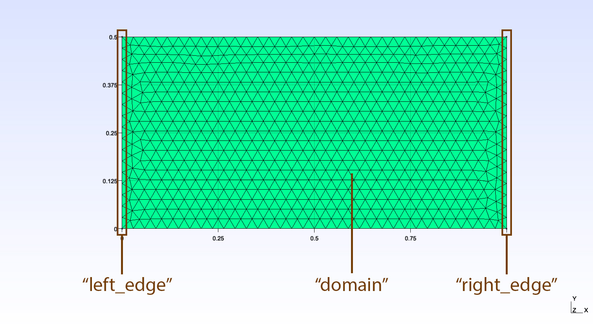

.. _channel_flow:

Channel Flow
============

This case demonstrates a minimal implementation of the solver. We will use Lizzy to simulate the filling of an isotropic rectangular panel, prescribing a one-dimensional flow. This classical infusion scenario is known as the Channel Flow experiment :cite:`weitzenbock1999`.

Copy the mesh file
------------------

The mesh file used in this example is available for :download:`download <../../../examples/meshes/Rect1M_R1.msh>`.
Create a new folder in a preferred location and name it something descriptive of the infusion scenarion, like *channel_flow* or similar. We will refer to this folder as the *working folder* and the entire Lizzy workflow will be run inside here.
Copy the mesh file into the working folder.

The mesh contains 3 domain tags ("physical groups" in msh format):

* *left_edge*: line tag assigned to the left edge of the mesh
* *right_edge*: line tag assigned to the right edge of the mesh
* *domain*: elements tag assigned to all elements in the mesh

These tags will be used to identify regions of the mesh for assignment of material properties and boundary conditions.

Create the script file
----------------------

Create a new python script in the new directory "_channel_flow_". In this example, the file is named `channel_infusion.py`, but any name will do.
In the first line of the script, let's import Lizzy by:

.. code-block:: python

    import lizzy as liz

Creating the Lizzy model
------------------------

Every simulation model in Lizzy is created and defined using the LizzyModel class. This is the main class of the solver and provides all APIs necessary to fully define a simulation scenario.

The first expression in asy Lizzy script is always to create the LizzyModel that will be used in the simulation:

.. code-block::

    model = liz.LizzyModel()

From now on, we will use this ``LizzyModel`` object to access all the relevant APIs.
Let's read the mesh file that we have copied:

.. code-block::

    model.read_mesh_file("Rect1M_R1.msh")

Make sure that the path given points to the mesh file that we have copied in the folder.
In this example, both the script and the mesh are in the working folder. If your folder structure is different, adjust the mesh path accordingly.

Now that the mesh is read, we need to define a few material and process properties. To do so, we use the ``assign_simulation_parameters`` method:

.. code-block:: python

    model.assign_simulation_parameters(mu=0.1, wo_delta_time=100)

``mu`` is the resin viscosity, ``wo_delta_time`` controls the interval of time at which the simulation result is saved in the results file. Omitting or assigning a negative value to ``wo_delta_time`` will save every single time step in the result file (usually undesired).

.. note::

    There is no particular order in the script as where the ``assign_simulation_parameters`` method should be called, as long as it is done *before* the solver is initialised by the ``initialise_solver`` method (further on). Failure to do so, or omitting the ``assign_simulation_parameters`` call entirely, will result in running the simulation with default values. The solver will warn us with a message: ``>>> Warning: Process parameters were not assigned. Running with default values: mu= 0.1, wo_delta_time= -1``

Next, we can define the properties of the materials in the mesh. At the moment, material definition is handled in the script (in the future this will change). We can do so by creating a material and then assigning it to a selected domain:

.. code-block:: python

    model.create_material(1E-10, 1E-10, 1E-10, 0.5, 1.0, "test_material")
    model.assign_material("test_material", 'domain')

The method ``create_material`` instantiates a ``PorousMaterial`` object which is stored in the model. The arguments of ``create_material`` are:

* ``k1`` (float): principal permeability value in local direction :math:`\mathbf{e}_1`
* ``k2`` (float): principal permeability value in local direction :math:`\mathbf{e}_2`
* ``k3`` (float): principal permeability value in local direction :math:`\mathbf{e}_3`
* ``porosity`` (float): the fraction of total material volume that is not occupied by solid material (1 - Vf)
* ``thickness`` (float): the thickness of the material.
* ``name`` (str): the name assigned to the material. This is used to identify the material from now on, for example when it needs to be selected for assignment by the following line: ``assign_material("material name", "mesh domain name")``

Note that no material orientation was defined. This is ok because the material declared is isotropic. Behind the scenes, Lizzy assigns a global rosette aligned with the global x, y, z axes when no rosette is declared. Local material orientations and zone-specific rosettes will be detailed in more advanced examples.

.. note::

    Each material tag present in the mesh must be assigned a material, otherwise we will get an error: ``>>> Mesh contains unassigned material tag: domain``

Boundary conditions
-------------------

Next, we will create some boundary conditions. In this example we will create an inlet on the left edge of the mesh.
At the moment, only inlets with assigned pressure are supported. Inlets are created following the same pattern as for materials: the inlet is created with a name, and then assigned:

.. code-block::

    model.create_inlet(1E+05, "inlet_left")
    model.assign_inlet("inlet_left", "left_edge")

The ``create_inlet`` method takes two arguments: the pressure value (``1E+05``) and the name of the inlet (``"inlet_left"``).

Initialise solver
-----------------

Once the simulation model has been completely defined, we call the ``initialise_solver`` method to finalise the model. This method should be called last, after all assignments have been made (inlets, materials, sensors, controls, etc...):

.. code-block::

    model.initialise_solver()

Solve
-----

The next step is to call the `solve` method to run the filling simulation:

.. code-block::

    solution = model.solve()

The ``solve`` method returns a ``Solution`` object, which is **not** stored in the LizzyModel and therefore must be captured.

Write results
-------------

The write-out of results in Paraview-compatible format is handled by the ``save_results`` method:

.. code-block::

    model.save_results(solution, "Rect1M_R1")

The ``save_results`` method takes two arguments: the solution object returned by the solver and a string that specifies the name of the folder that will be created and where the results will be saved.

The full script
---------------

.. code-block::

    import lizzy as liz

    model = liz.LizzyModel()
    model.read_mesh_file("Rect1M_R1.msh")
    model.assign_simulation_parameters(mu=0.1, wo_delta_time=100)
    model.create_material(1E-10, 1E-10, 1E-10, 0.5, 1.0, "example_material")
    model.assign_material("example_material", 'domain')
    model.create_inlet(100000, "inlet_left")
    model.assign_inlet("inlet_left", "left_edge")
    model.initialise_solver()
    solution = model.solve()
    model.save_results(solution, "Rect1M_R1")

Solution visualisation
----------------------

The results are saved in a folder ``results`` which is created in the current working directory of the interpreter. By default, Lizzy will save results in the ``XDMF`` format, leveraging HDF5 database in binary format to store the actual data.  Load the file ``Rect1M_R1_RES.xdmf`` into Paraview to visualise the results in a time series.
Lizzy will save the following fields: "FillFactor", "FreeSurface", "Pressure", "Velocity". In the picture, an example of fill factor at t=300s.

.. tip::

    The mesh of control volumes can be saved by adding the optional argument ``save_cv_mesh=True`` in the ``Writer.save_results()`` method. Doing so will also export a file ``Rect1M_R1_CV.vtk`` that can be loaded in Paraview and superimposed onto the results mesh:

    .. image:: ../../images/Rect1M_R1_CV.png
       :width: 60%
       :align: center

References
----------

.. bibliography:: ../refs.bib
   :style: unsrt