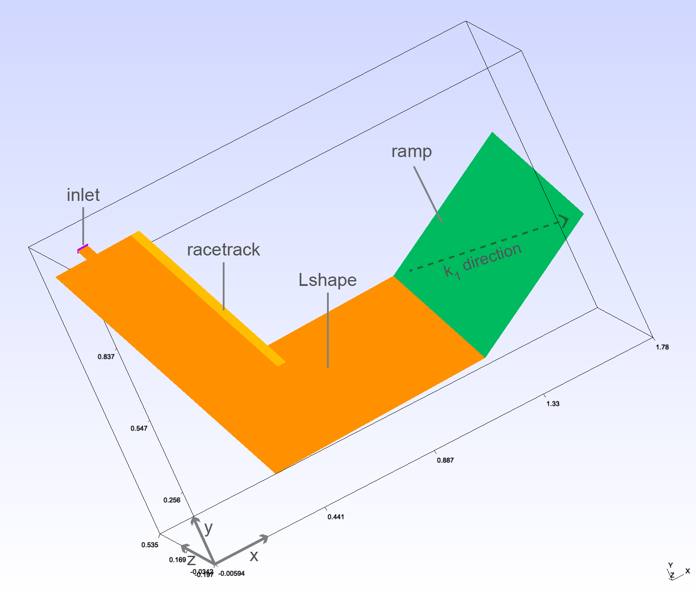
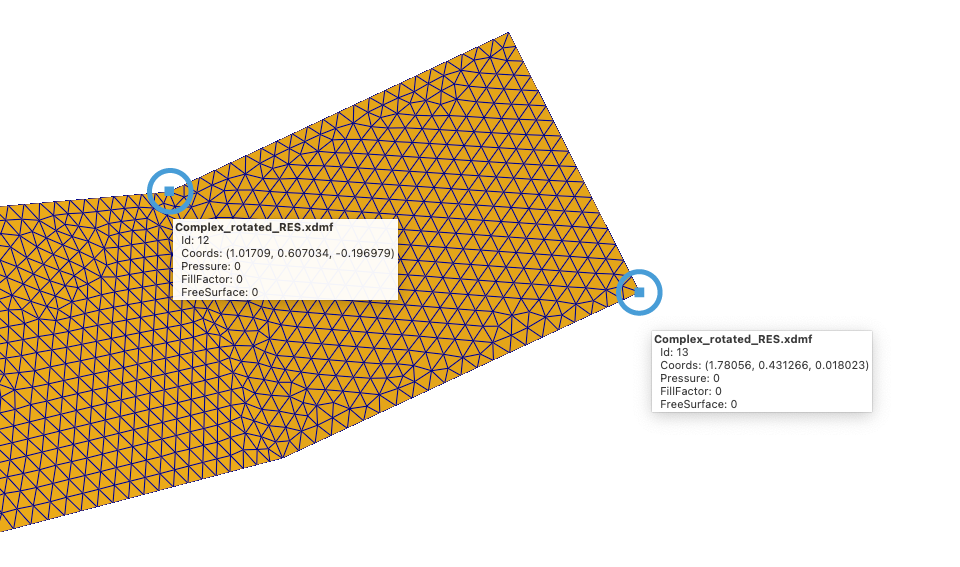
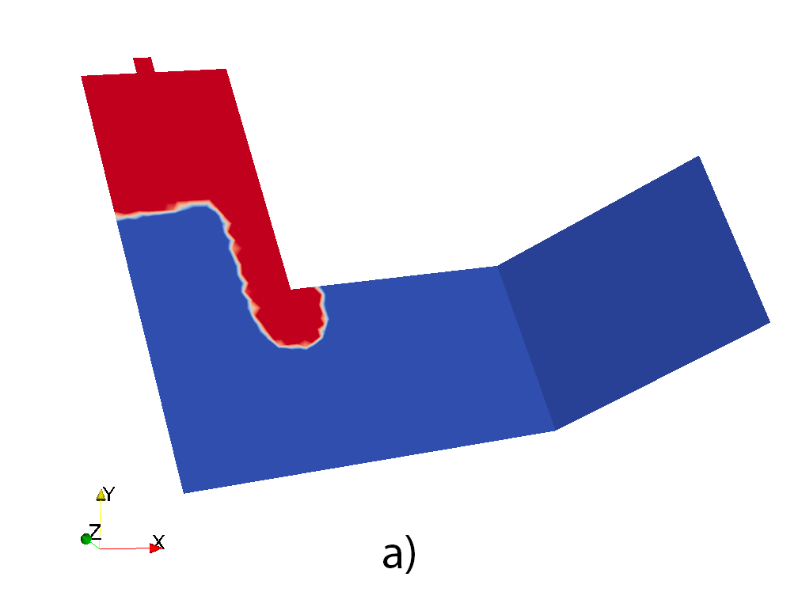
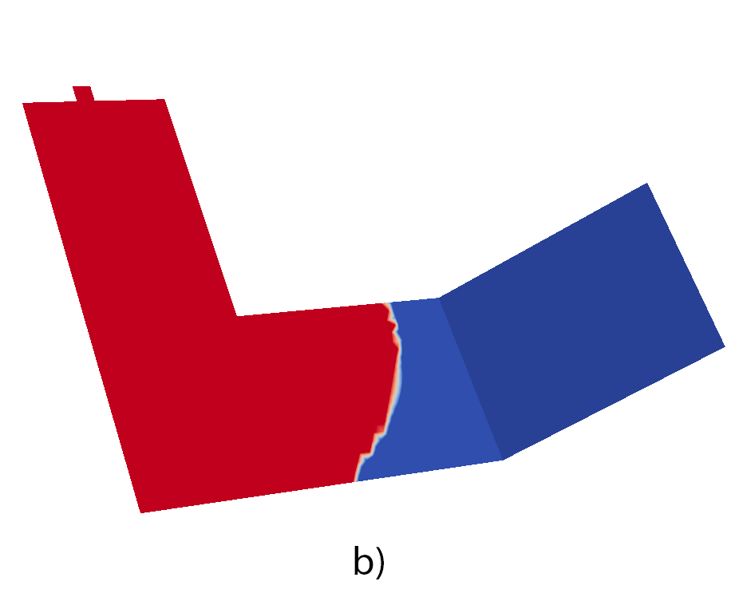
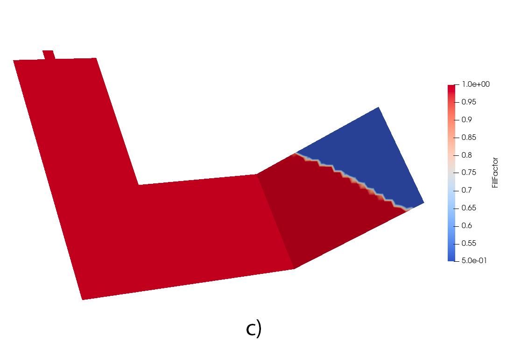

.. _complex_case:

Complex case
============

In this tutorial we will tackle a more complex scenario that includes several elements all at once. We will simulate the filling of a non-planar shape, arbitrarily oriented in space, that contains several different materials. This example uses features introduced in the :ref:`channel_flow` and :ref:`anisotropy` examples.

Copy the mesh file
------------------

Create a folder in a preferred location and copy the :download:`mesh file <../../../examples/meshes/Complex_rotated.msh>` in the new directory.
Let's take a look at the geometry:

The first thing we can notice is that none of the geometry edges are aligned with any global axis. The shape is rotated arbitrarily in space, therefore defining orientations will be important for any anisotropic material we will use.
The shape is composed by an L-shaped zone, which bends upwards into a ramp. In the first region we also have a racetrack on the side of the domain.
The mesh contains the appropriate domain tags ("physical groups" in msh format): *Lshape*, *ramp*, *racetrack*, *inlet*.

We want to define the case as following:

    * The L-shaped region is isotropic.
    * The ramp region is anisotropic, with principal permeability :math:`k_1` oriented along the diagonal direction indicated in the picture.
    * The racetrack is isotropic, has much higher permeability and half the thickness than the rest of the domain.

Import and parameters
---------------------

To begin with, we create a mesh and define some process parameters as usual:

.. code-block::

    import lizzy as liz

    # read mesh
    model = liz.LizzyModel()
    model.read_mesh_file("Complex_rotated.msh")

    # assign viscosity
    model.assign_simulation_parameters(mu=0.1, wo_delta_time=100)

Creating materials
------------------

We shall create the following materials:

.. code-block::

    model.create_material(1E-10, 1E-10, 1E-10, 0.5, 1.0, "material_iso")
    model.create_material(1E-10, 1E-11, 1E-11, 0.5, 1.0, "material_aniso")
    model.create_material(1E-7, 1E-7, 1E-7, 0.5, 0.5, "material_racetrack")

As we can see, one of the materials (``material_aniso``) is anisotropic by one order of magnitude between :math:`k_1` and :math:`k_2`. Furthermore, the racetrack material has a mich higher permeability (3 orders of magnitude higher than ``material_iso`` and half the thickness.

Defining orientations
---------------------

We need to define an orientation for the anisotropic material ``material_aniso``. In this special case, this is particularly important because the entire geometry is arbitrarily rotated in space, so the default rosette is useless. In the example :ref:`anisotropy` we have seen how we can define a ``Rosette`` by passing an orientation vector. There are cases, however, when this is inconvenient and would require effort to calculate, as the components of the orientation vector may not be known before.

Luckily, the ``Rosette`` constructor can work with different input styles. In this case, the most convenient way is to use a 2-point initialisation. We can pass 2 arguments to ``Rosette``, each being an ``(x, y, z)`` tuple of values that represents a point in space. The direction vector will be constructed as the line passing through them. Using the definition ``Rosette((x1,y1,z1), (x2,y2,z2))`` we simply need to know the global coordinates of 2 points aligned in the direction of the :math:`k_1` orientation. In our example, we can use a visualisation tool to measure our coordinates (example using Paraview):

By inspecting the mesh we obtain the following information:

    * node 1: id = 12, coordinates = (1.017, 0.607, -0.196)
    * node 2: id = 13, coordinates = (1.780, 0.431, 0.018)

We could now create an orientation rosette by simply using these values: ``Rosette( (1.017, 0.607, -0.196), (1.780, 0.431, 0.018) )``. Even better, we can avoid working with copy-paste numbers. All we need is to know the number (ID) of the nodes that span the orientation vector: in this case 12 and 13. Then, we can get the ``Node`` objects from the model using the ``get_node_by_id`` method, and use the ``coords`` attribute of the node to get the (:math:`x, y, z`) values neatly:

.. code-block::

    rosette_ramp = liz.Rosette(model.get_node_by_id(12).coords, model.get_node_by_id(13).coords)

.. note::
    The ``Rosette`` APIs are being reworked and may change in a future update.

Assigning materials
-------------------

Now that our orientation rosette for the anisotropic region is defined, we can proceed to assign all materials the usual way:

.. code-block::

    model.assign_material("material_iso", "Lshape")
    model.assign_material("material_aniso", "ramp", rosette_ramp)
    model.assign_material("material_racetrack", "racetrack")

Completing the script
---------------------

We can now conclude the script by assigning BCs and launching the solver. Nothing new here:

.. code-block::

    # BCs
    model.create_inlet(1E+05, "inlet")
    model.assign_inlet("inlet", "inlet")

    # Solve
    model.initialise_solver()
    solution = model.solve()

    # Save results
    model.save_results(solution, "Complex_rotated")

The full script
---------------

.. code-block::

    import lizzy as liz

    model = liz.LizzyModel()
    model.read_mesh_file("Complex_rotated.msh")

    model.assign_simulation_parameters(mu=0.1, wo_delta_time=100)

    model.create_material(1E-10, 1E-10, 1E-10, 0.5, 1.0, "material_iso")
    model.create_material(1E-10, 1E-11, 1E-11, 0.5, 1.0, "material_aniso")
    model.create_material(1E-7, 1E-7, 1E-7, 0.5, 0.5, "material_racetrack")
    rosette_ramp = liz.Rosette(model.get_node_by_id(12).coords, model.get_node_by_id(13).coords)
    model.assign_material("material_iso", "Lshape")
    model.assign_material("material_aniso", "ramp", rosette_ramp)
    model.assign_material("material_racetrack", "racetrack")

    model.create_inlet(1E+05, "inlet")
    model.assign_inlet("inlet", "inlet")

    model.initialise_solver()
    solution = model.solve()
    model.save_results(solution, "Complex_rotated")

Solution visualisation
----------------------

Load up the file ``Complex_rotated_RES.xdmf`` into Paraview to visualise the results:

Observing the fill pattern we see that the flow front speeds up in the racetrack (a), fills gradually the L-shape (b) and finally rotates its orientation as it traverses the ramp because of the anisotropy (c).