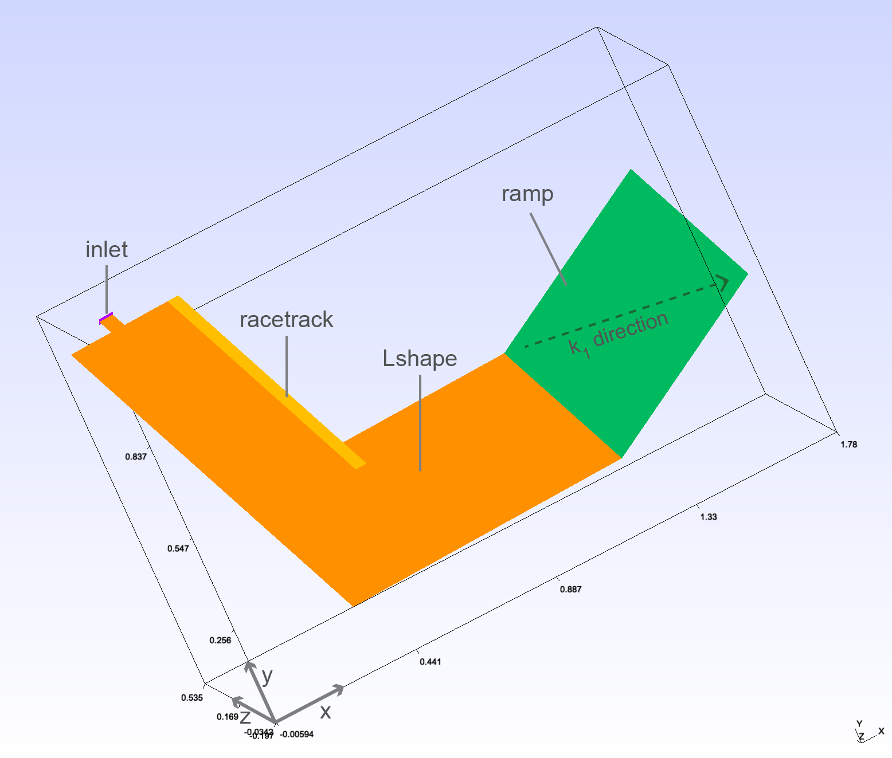
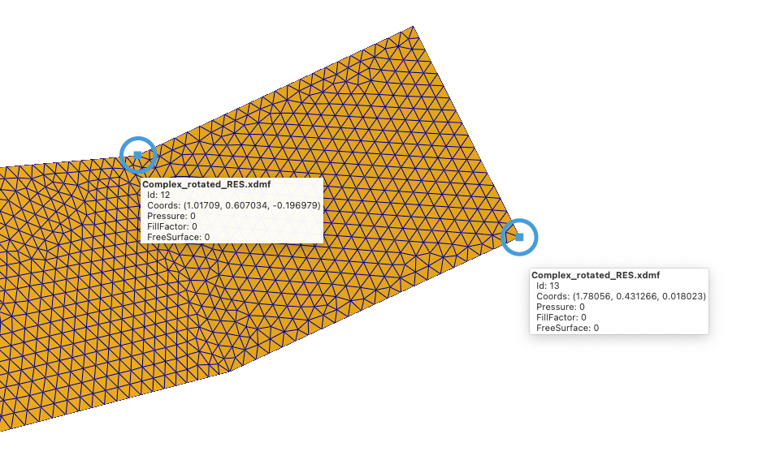
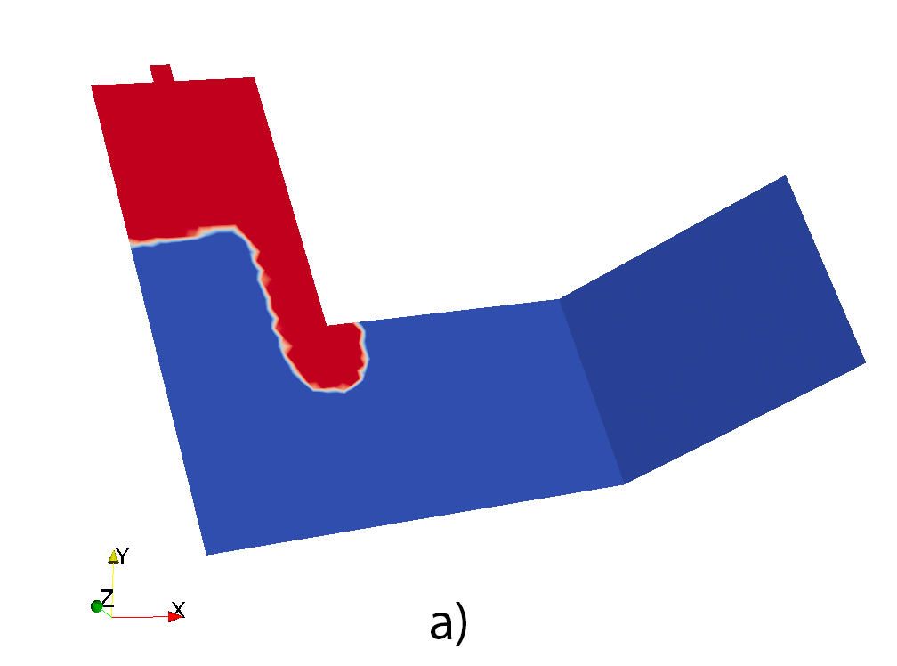
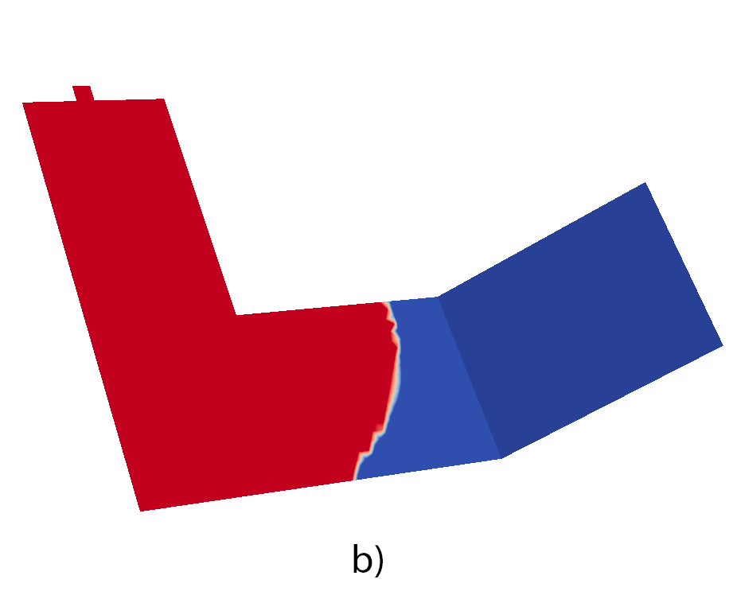
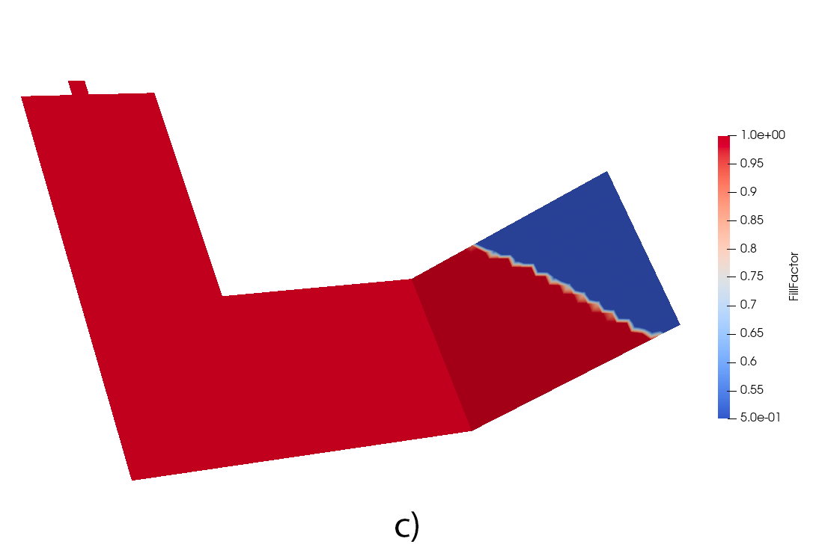

.. _complex_case:
.. py:currentmodule:: lizzy

Complex case
============

In this tutorial we will tackle a more complex scenario that includes several elements all at once. We will simulate the filling of a non-planar shape, arbitrarily oriented in space, that contains several different materials. This example uses features introduced in the :ref:`channel_flow` and :ref:`anisotropy` examples.

All files used in this tutorial are available in the `tutorials/complex <../../../tutorials/complex/>`_ folder. We recommend you download the :download:`mesh alone <../../../tutorials/complex/Complex.msh>` and create the script yourself following the tutorial.

.. note::

    If you have not yet completed the :ref:`channel_flow` tutorial, we advise to do that first because here we will not cover in detail the steps that were already introduced.

The mesh
--------

The mesh represents a strange-looking shape that extends in three dimensions:

We can notice that none of the geometry edges are aligned with any global axis: the part is rotated arbitrarily in space, therefore defining orientations will be important for any anisotropic material we will use.
The shape is composed by an L-shaped zone, which bends upwards into a ramp. In the first region we also have a 2 mm wide strip representing a racetrack on the side of the domain.

The mesh contains 4 domain tags:

* *Lshape*: elements tag assigned to the L-shaped region
* *ramp*: elements tag assigned to the ramp region
* *racetrack*: elements tag assigned to the thin strip on the side of the L-shape
* *inlet*: line tag assigned to the inlet edge of the part

We want to define the case as following:

* The L-shaped region is isotropic.
* The ramp region is anisotropic, with principal permeability :math:`k_1` oriented along the diagonal direction indicated in the picture.
* The racetrack is isotropic, has much higher permeability and half the thickness than the rest of the domain.
  

Preparing the working folder
----------------------------

Follow the same steps described in :ref:`channel_flow` to set up the working folder and copy the mesh file into it. Create a new Python script — in this example we name it ``complex.py``.

Setting up the model
--------------------

Let's import Lizzy and configure logging:

.. code-block:: python

    import lizzy

    import logging
    logging.basicConfig(level=logging.INFO)

Let's create the :class:`LizzyModel` and read the mesh:

.. code-block:: python

    model = lizzy.LizzyModel()
    model.read_mesh_file("Complex.msh")
    model.set_simulation_parameters(output_interval=10, progress_bar=True)

Let's also define a resin with viscosity 0.1 Pa s:

.. code-block:: python

    model.create_resin("resin_01", 0.1)
    model.assign_resin("resin_01")

So far, nothing new. However, things will get more interesting as now we will need to define anisotropic materials on geometries that are arbitrarily oriented in space.

Creating materials
------------------

We can start by creating the following materials:

.. code-block::

    model.create_material("material_iso", (1E-10, 1E-10, 1E-10), 0.5, 0.002)
    model.create_material("material_aniso", (1E-10, 1E-11, 1E-11), 0.5, 0.002)
    model.create_material("material_racetrack", (1E-7, 1E-7, 1E-7), 0.5, 0.001)

As we can see, one of the materials (``material_aniso``) is anisotropic by one order of magnitude between :math:`k_1` and :math:`k_2`. Furthermore, the racetrack material has a much higher permeability (3 orders of magnitude higher than ``material_iso`` and half the thickness.

Defining orientations
---------------------

We need to define an orientation for the anisotropic material ``material_aniso``. In this special case, this is particularly important because the entire geometry is arbitrarily rotated in space, so the default rosette is useless. In the example :ref:`anisotropy` we have seen how we can define a ``Rosette`` by passing an orientation vector. There are cases, however, when this is inconvenient and would require effort to calculate, as the components of the orientation vector may not be known before.

Luckily, the ``Rosette`` constructor can work with different input styles. In this case, the most convenient way is to use a 2-point initialisation. We can pass 2 arguments to ``Rosette``, each being an ``(x, y, z)`` tuple of values that represents a point in space. The direction vector will be constructed as the line passing through them. Using the definition ``Rosette((x1,y1,z1), (x2,y2,z2))`` we simply need to know the global coordinates of 2 points aligned in the direction of the :math:`k_1` orientation. In our example, we can use a visualisation tool to measure our coordinates (example using Paraview):

By inspecting the mesh we obtain the following information:

    * node 1: id = 12, coordinates = (1.017, 0.607, -0.196)
    * node 2: id = 13, coordinates = (1.780, 0.431, 0.018)

Conveniently, we won't have to write down those numbers: if we know the index of a node, we can access the :class:`~lizzy.entities.Node` object from the model using the :meth:`~lizzy.LizzyModel.get_node_by_idx` method, and use the :attr:`~lizzy.entities.Node.coords` attribute of the node to get its (:math:`x, y, z`) coordinates. Then calculating the direction vector becomes trivial:

.. code-block::

    dir = model.get_node_by_id(13).coords - model.get_node_by_id(12).coords
    
Now that we have our direction, we can create the rosette as usual:

.. code-block::

    rosette_ramp = model.create_rosette("rosette_ramp", dir)

.. note::
    The ``Rosette`` APIs are being reworked and may change in a future update.

Assigning materials
-------------------

Now that our orientation rosette for the anisotropic region is defined, we can proceed to assign all materials the usual way:

.. code-block::

    model.assign_material("material_iso", "Lshape")
    model.assign_material("material_aniso", "ramp", "rosette_ramp")
    model.assign_material("material_racetrack", "racetrack")

Completing the script
---------------------

We can now conclude the script by assigning BCs and launching the solver. Nothing new here:

.. code-block::

    # BCs
    model.create_pressure_inlet("inlet", 1E+05)
    model.assign_inlet("inlet", "inlet")

    # Solve
    model.initialise_solver()
    model.solve()

    # Save results
    model.save_results()

The full script
---------------

.. code-block::

    import lizzy as liz

    model = liz.LizzyModel()
    model.read_mesh_file("Complex_rotated.msh")

    model.set_simulation_parameters(output_interval=100)
    model.create_resin("resin", viscosity=0.1)
    model.assign_resin("resin")

    model.create_material("material_iso", (1E-10, 1E-10, 1E-10), 0.5, 1.0)
    model.create_material("material_aniso", (1E-10, 1E-11, 1E-11), 0.5, 1.0)
    model.create_material("material_racetrack", (1E-7, 1E-7, 1E-7), 0.5, 0.5)
    rosette_ramp = liz.Rosette(model.get_node_by_id(12).coords, model.get_node_by_id(13).coords)
    model.assign_material("material_iso", "Lshape")
    model.assign_material("material_aniso", "ramp", rosette_ramp)
    model.assign_material("material_racetrack", "racetrack")

    model.create_pressure_inlet("inlet", 1E+05)
    model.assign_inlet("inlet", "inlet")

    model.initialise_solver()
    solution = model.solve()
    model.save_results(solution, "Complex_rotated")

Solution visualisation
----------------------

Load up the file ``Complex_rotated_RES.xdmf`` into Paraview to visualise the results:

Observing the fill pattern we see that the flow front speeds up in the racetrack (a), fills gradually the L-shape (b) and finally rotates its orientation as it traverses the ramp because of the anisotropy (c).