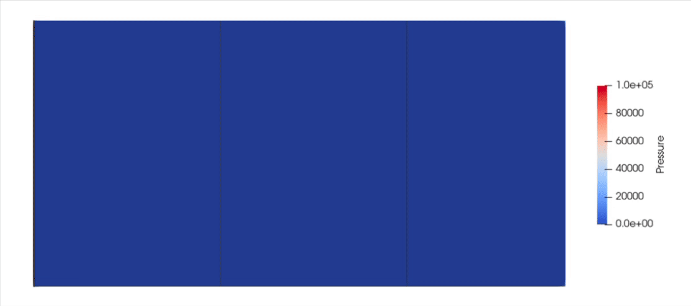

.. _gatescontrol:
.. py:currentmodule:: lizzy

Gates Control
=============

In this tutorial we will learn how to build a dynamic infusion process using sensors and gate controls. We will simulate a sequential multi-inlet infusion strategy, where inlets are initially closed and get opened progressively as the flow front advances through the part.
The idea is that we will create some virtual sensors on the part, and use their signal to trigger the opening of inlets.

All files used in this tutorial are available in the `tutorials/gates_control <../../../tutorials/gates_control/>`_ folder. We recommend you download the :download:`mesh alone <../../../tutorials/gates_control/GatesControl.msh>` and create the script yourself following the tutorial.

.. note::

    If you have not yet completed the :ref:`channel_flow` tutorial, we advise to do that first because here we will not cover in detail the steps that were already introduced.

The mesh
--------

The mesh represents a 1 m × 0.5 m rectangular panel. The part has three thin strips, extruded normal to the plane of the domain: the first at x=0m, the second at x=0.35m and the third at x=0.70m. We will use these to define inlets. The mesh contains 5 physical groups:

* *edge_1*: line tag assigned to the left edge of the part (x = 0)
* *edge_2*: line tag assigned to the edge of the strip at x = 0.35 m
* *edge_3*: line tag assigned to the edge of the strip at x = 0.70 m
* *inlet*: elements tag assigned to the three thin strips
* *domain*: elements tag assigned to the main laminate regions

Preparing the working folder
----------------------------

Follow the same steps described in :ref:`channel_flow` to set up the working folder and copy the mesh file into it. Create a new Python script — in this example we name it ``gates_control.py``.

Setting up the model
--------------------

Let's import Lizzy and configure logging:

.. code-block:: python

    import lizzy

    import logging
    logging.basicConfig(level=logging.INFO)

Let's create the :class:`LizzyModel` and read the mesh:

.. code-block:: python

    model = lizzy.LizzyModel()
    model.read_mesh_file("GatesControl.msh")
    model.set_simulation_parameters(output_interval=10, progress_bar=False, end_step_when_sensor_triggered=True)

.. note::

    ``end_step_when_sensor_triggered=True`` instructs the solver to interrupt the current solving operation as soon as a sensor registers resin arrival. We will use this to pause the filling in-between inlet activations.

Creating materials
------------------

Define a resin with viscosity 0.1 Pa s:

.. code-block:: python

    model.create_resin("resin_01", 0.1)
    model.assign_resin("resin_01")

This mesh has two surface domains, so we must assign a material to each of them. The inlet strips are modelled as a highly permeable distribution layer — here, an arbitrarily high value — which causes them to fill almost instantly and with very little pressure drop.

.. code-block:: python

    model.create_material("inlet_material", (1E-8, 1E-8, 1E-8), 1.0, 0.010)
    model.assign_material("inlet_material", 'inlet')

    model.create_material("domain_material", (1E-10, 1E-10, 1E-10), 0.5, 0.005)
    model.assign_material("domain_material", 'domain')

.. important::

    Each material tag present in the mesh must be assigned a material, otherwise initialisation will raise a :class:`lizzy.MeshError`.

Boundary conditions
-------------------

We define three pressure inlets, one on each vertical edge:

.. code-block:: python

    model.create_pressure_inlet("inlet_1", 1E+05)
    model.assign_inlet("inlet_1", "edge_1")

    model.create_pressure_inlet("inlet_2", 1E+05)
    model.assign_inlet("inlet_2", "edge_2")

    model.create_pressure_inlet("inlet_3", 1E+05)
    model.assign_inlet("inlet_3", "edge_3")

Note that all three inlets are created here in the pre-initialisation phase. There is no notion of their open/closed state at this point. The logic for opening and closing inlets must be defined **after** initialisation.

Creating sensors
----------------

We will now create :class:`lizzy.Sensor` objects to track the arrival of the resin at specified positions. We place two sensors 1 cm downstream of the second and third inlets: one at x=0.36 m and the other at x=0.71 m. This way, when a sensor triggers, we know that the flow front has just passed the corresponding inlet, and we can safely open it.

.. code-block:: python

    model.create_sensor("sensor_01", (0.36, 0.25, 0))
    model.create_sensor("sensor_02", (0.71, 0.25, 0))

.. note::

    There is no need for absolute precision in the sensor coordinates: they are snapped to the nearest mesh nodes automatically.

The control loop
----------------

Now we are ready to define the control logic. The idea is to run the simulation in a loop, checking the sensor states at each iteration and opening inlets when they trigger.
First, initialise the solver as usual:

.. code-block:: python

    model.initialise_solver()

Before beginning to fill the part, we close the two downstream inlets so that filling begins only from the left edge:

.. code-block:: python

    model.close_inlet("inlet_2")
    model.close_inlet("inlet_3")

.. note::

    Inlets can only be opened or closed after :meth:`~lizzy.LizzyModel.initialise_solver` has been called. Attempting to do so before initialisation will raise a :class:`lizzy.StateError`.

Rather than calling :meth:`~lizzy.LizzyModel.solve` once to run until filled, we will use the method :meth:`~lizzy.LizzyModel.solve_time_interval` in a loop. This method advances the simulation by at most the given duration (in seconds) and returns control to the next expression. More importanly though, this mode can be interrupted as soon as a sensor triggers (activated when we set ``end_step_when_sensor_triggered=True`` in the simulation parameters earlier):

.. code-block:: python

    while model.get_sensor_by_name("sensor_01").resin_arrived == False:
        model.solve_time_interval(10000)

Notice that we have set the time interval to a very large value, which will never be reached because the trigger condition will trigger sooner.
Once ``sensor_01`` triggers — meaning the flow front has crossed x = 0.36 m — we open the second inlet and continue injecting until ``sensor_02`` fires:

.. code-block:: python

    model.open_inlet("inlet_2")
    while model.get_sensor_by_name("sensor_02").resin_arrived == False:
        model.solve_time_interval(10000)

Finally, we open the third inlet and run the simulation to full part fill:

.. code-block:: python

    model.open_inlet("inlet_3")
    model.solve()

Save results
------------

.. code-block:: python

    model.save_results()

The full script
---------------

.. code-block:: python

    import lizzy

    # Set up logging level
    import logging                                                                                                          
    logging.basicConfig(level=logging.INFO)

    # Set up the model: notice ``end_step_when_sensor_triggered=True`` because we want to use sensors to control the process.
    model = lizzy.LizzyModel()
    model.read_mesh_file("GatesControl.msh")
    model.set_simulation_parameters(output_interval=10, progress_bar=False, end_step_when_sensor_triggered=True)

    # Resin
    model.create_resin("resin_01", 0.1)
    model.assign_resin("resin_01")

    # Materials
    model.create_material("inlet_material", (1E-8, 1E-8, 1E-8), 1.0, 0.010)
    model.assign_material("inlet_material", 'inlet')

    model.create_material("domain_material", (1E-10, 1E-10, 1E-10), 0.5, 0.005)
    model.assign_material("domain_material", 'domain')

    # Boundary conditions
    model.create_pressure_inlet("inlet_1", 1E+05)
    model.assign_inlet("inlet_1", "edge_1")

    model.create_pressure_inlet("inlet_2", 1E+05)
    model.assign_inlet("inlet_2", "edge_2")

    model.create_pressure_inlet("inlet_3", 1E+05)
    model.assign_inlet("inlet_3", "edge_3")

    # Sensors
    model.create_sensor("sensor_01", (0.36, 0.25, 0))
    model.create_sensor("sensor_02", (0.71, 0.25, 0))

    #Solver initialisation: this must be called before we can open or close inlets, or check sensor states.
    model.initialise_solver()
    model.close_inlet("inlet_2")
    model.close_inlet("inlet_3")

    # Start filling
    while model.get_sensor_by_name("sensor_01").resin_arrived == False:
        model.solve_time_interval(10000)

    # Resin has reached sensor_01, open the second inlet
    model.open_inlet("inlet_2")
    while model.get_sensor_by_name("sensor_02").resin_arrived == False:
        model.solve_time_interval(10000)

    # Resin has reached sensor_02, open the third inlet
    model.open_inlet("inlet_3")
    model.solve()

    # Save results
    model.save_results()

Solution visualisation
----------------------

Load the file ``GatesControl_RES.xdmf`` into Paraview to visualise the results. When prompted, make sure to select **`Xdmf3 Reader S`** to avoid formatting issues.

The sequential opening of the inlets should be clearly visible in the flow front progression. More so if we plot the velocity field (which will spike when inlets open) or the pressure field (which will explicitely show the pressure firing at the inlets when they open). Is is worth noting how, as expected, the total fill time is significantly reduced from the :ref:`channel_flow` tutorial, even though the part has the same geometry.

