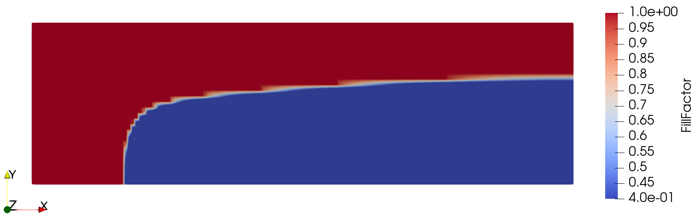

.. _racetracking:
.. py:currentmodule:: lizzy

Racetracking
============

This case demonstrates how to set up a simulation with multiple material domains. We will simulate the filling of a rectangular panel that has a side racetrack: a thin, highly-permeable channel running along one edge of the part. Racetracks can occur when the laminate is laid up in the mold and can disrupt the flow front.

All files used in this tutorial are available in the `tutorials/racetracking <../../../tutorials/racetracking/>`_ folder. We recommend you download the :download:`mesh alone <../../../tutorials/racetracking/ChannelRacetrack.msh>` and create the script yourself following the tutorial.

If you have not yet completed the :ref:`channel_flow` tutorial, we advise to do that first because here we will not cover in detail the steps that were already introduced.

The mesh
--------

The mesh represents a 1 m × 0.3 m rectangle. A thin strip of 2 mm height runs along the top edge, representing the racetrack gap. The mesh contains 4 domain tags:

* *left_edge*: line tag assigned to the left edge of both the domain and the racetrack
* *right_edge*: line tag assigned to the right edge of both the domain and the racetrack
* *domain*: elements tag assigned to the main laminate region
* *racetrack*: elements tag assigned to the thin top strip

Preparing the working folder
----------------------------

Follow the same steps described in :ref:`channel_flow` to set up the working folder and copy the mesh file into it. Create a new Python script — in this example we name it ``racetrack.py``.

Setting up the model
--------------------

This section is largely identical to the :ref:`channel_flow` example, so see that for details.
Let's import Lizzy and configure logging:

.. code-block:: python

    import lizzy

    import logging
    logging.basicConfig(level=logging.INFO)

Let's create the :class:`LizzyModel`, read the mesh file and set some parameters:

.. code-block:: python

    model = lizzy.LizzyModel()
    model.read_mesh_file("ChannelRacetrack.msh")
    model.set_simulation_parameters(output_interval=5, progress_bar=True)

Note that we set the output interval to 5 seconds (more frequent solutions write out) because the flow front will move very quickly through the racetrack.

Now let's define a resin with viscosity 0.1 Pa s:

.. code-block:: python

    model.create_resin("resin_01", 0.1)
    model.assign_resin("resin_01")

Creating materials
------------------

This is where the setup differs from the :ref:`channel_flow` case. Because the mesh has two surface tags, we need to assign a material to each of them.

First, let's create and assign the laminate material. We will stick to the same used in the :ref:`channel_flow` case:

.. code-block:: python

    model.create_material("domain_material", (1E-10, 1E-10, 1E-10), 0.5, 0.005)
    model.assign_material("domain_material", "domain")

Now we can define the racetrack material. A racetrack not a porous material, so does it not have a proper permeability. However, we can resort to  **lubrication approximation** theory to calculate the equivalent permeability when in presence of a thin film of fluid between two parallel plates. The equivalent permeability for laminar flow in such a geometry is ``k = H**2 / 12``, where ``H`` is the gap height. Since the gap is fully open and contains no fibres, its porosity is 1.0. Let's compute the permeability and create the material:

.. code-block:: python

    racetrack_gap = 0.002  # from the mesh construction
    racetrack_perm = racetrack_gap**2 / 12

    model.create_material("racetrack_material", (racetrack_perm, racetrack_perm, racetrack_perm), 1.0, 0.005)
    model.assign_material("racetrack_material", "racetrack")

.. important::

    Each material tag present in the mesh must be assigned a material, otherwise initialisation will raise an error.

Boundary conditions
-------------------

The boundary conditions are the same as in the :ref:`channel_flow` case, and the mesh uses the same tags:

.. code-block:: python

    model.create_pressure_inlet("inlet_left", 100000)
    model.assign_inlet("inlet_left", "left_edge")

    model.create_vent("vent_right", 0.0)
    model.assign_vent("vent_right", "right_edge")

Initialise, solve and save results
----------------------------------

The following steps are identical to the :ref:`channel_flow` case:

.. code-block:: python

    model.initialise_solver()
    model.solve()
    model.save_results()

The full script
---------------

.. code-block:: python

    import lizzy

    import logging
    logging.basicConfig(level=logging.INFO)

    racetrack_gap = 0.002
    racetrack_perm = racetrack_gap**2 / 12

    model = lizzy.LizzyModel()
    model.read_mesh_file("ChannelRacetrack.msh")
    model.set_simulation_parameters(output_interval=5, progress_bar=True)

    model.create_resin("resin_01", 0.1)
    model.assign_resin("resin_01")

    model.create_material("domain_material", (1E-10, 1E-10, 1E-10), 0.5, 0.005)
    model.assign_material("domain_material", "domain")

    model.create_material("racetrack_material", (racetrack_perm, racetrack_perm, racetrack_perm), 1.0, 0.005)
    model.assign_material("racetrack_material", "racetrack")

    model.create_pressure_inlet("inlet_left", 100000)
    model.assign_inlet("inlet_left", "left_edge")

    model.create_vent("vent_right", 0.0)
    model.assign_vent("vent_right", "right_edge")

    model.initialise_solver()
    model.solve()

    model.save_results()

Solution visualisation
----------------------

Load the file ``ChannelRacetrack_RES.xdmf`` into Paraview to visualise the results. When prompted, make sure to select **`Xdmf3 Reader S`** to avoid formatting issues.

Because the racetrack permeability is several orders of magnitude higher than the bulk laminate, the fluid reaches the right edge quickly along the top strip and then propagates downward into the part. This produces the characteristic L-shaped flow front that we observe.

