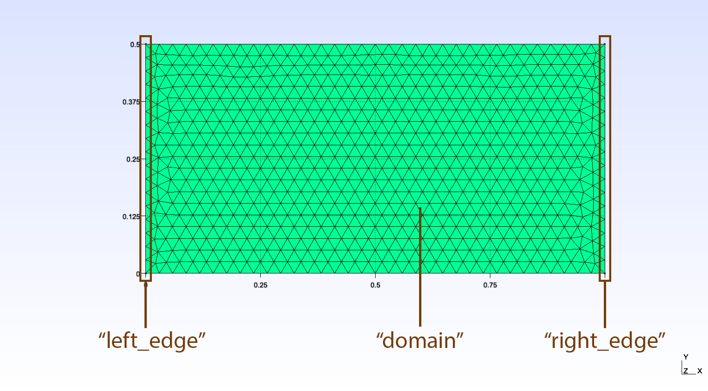

Boundary conditions operations
==================================

In this section we look at various boundary condition operations, including creating boundary conditions and modifying them at runtime.
All operations can be performed using the :class:`~lizzy.LizzyModel` user-facing methods. For more details about the underlying core components, please refer to the :ref:`api_reference_index` documentation.

Creation and assignment of inlets
----------------------------------

The following operations are to be performed **before** the solver is initialised by calling :meth:`~lizzy.LizzyModel.initialise_solver`.

Creating an inlet
~~~~~~~~~~~~~~~~~~

Let's say we have imported a mesh with one boundary named "left_edge" and one boundary names "right_edge", and we want to assign an inlet boundary condition to the "left_edge" boundary:

.. code-block:: console

    >>> model.print_mesh_info()
    >>> 
        Mesh file format: MSH (v4 ASCII),
        Case name:    EXAMPLE_EDGES,
        Mesh contains 1500 nodes, 3000 elements.
        Physical domains:        ['domain']
        Physical lines:          ['left_edge', 'right_edge']

First, we will create an inlet using the :meth:`~lizzy.LizzyModel.create_inlet` method. This method requires two arguments: the inlet initial pressure (in Pa) and a unique string identifier for the inlet. Let's create an inlet with a pressure of 1.0E05 Pa tagged as "inlet_1":

.. code-block::

    model.create_inlet(1e5, "inlet_1")

An :class:`~lizzy.gates.Inlet` object is created and stored in the model, but it is not assigned yet. To assign the inlet to a specific boundary, we use the :meth:`~lizzy.LizzyModel.assign_inlet` method, providing the name of the inlet and the name of the mesh boundary where we want to assign it:

.. code-block::

    model.assign_inlet("inlet_1", "left_edge")

.. tip::

    An alternative way to assign inlets is to pass them direcltly by reference. When creating an inlet, an :class:`~lizzy.gates.Inlet` object is returned. This object can be stored in a variable and passed directly to the :meth:`~lizzy.LizzyModel.assign_inlet` method. For example:

    .. code-block::

        new_inlet = model.create_inlet(1e5, "inlet_1")
        model.assign_inlet(new_inlet, "left_edge")

Once an inlet is assigned, it is set to "open" state by default. We can check its state at any time using the :attr:`~lizzy.gates.Inlet.is_open` property (read-only).

.. code-block:: console

    >>> new_inlet = model.create_inlet(1e5, "inlet_1")
    >>> model.assign_inlet(new_inlet, "left_edge")
    >>> new_inlet.is_open

        True

Fetching inlets from the model
~~~~~~~~~~~~~~~~~~~~~~~~~~~~~~~~~~~~

To fetch an existing inlet from the model using its unique tag, we can use the :meth:`~lizzy.LizzyModel.fetch_inlet_by_name` method. This method requires the inlet name. For example, to fetch the inlet tagged as "inlet_1", we would do:

.. code-block::

    inlet = model.fetch_inlet_by_name("inlet_1")

This expression returns the :class:`~lizzy.gates.Inlet` object with that name. We can then use this object to access its properties and methods.

.. note::

    This method works even at runtime, i.e., after the solver has been initialised by calling :meth:`~lizzy.LizzyModel.initialise_solver`.

Runtime operations
-------------------

The following operations can be performed at any time **after** the solver has been initialised by calling :meth:`~lizzy.LizzyModel.initialise_solver`.

Opening / closing inlets
~~~~~~~~~~~~~~~~~~~~~~~~~

To open or close an existing inlet during the simulation, we can use the :meth:`~lizzy.LizzyModel.open_inlet` and :meth:`~lizzy.LizzyModel.close_inlet` methods, respectively. Both methods require a single argument: the inlet tag. For example, to close the inlet tagged as "inlet_1", we would do:

.. code-block::

    model.close_inlet("inlet_1")

This expression turns the inlet boundary into a wall boundary (Neumann natural boundary condition). To open the inlet at any time, we would do:

.. code-block::

    model.open_inlet("inlet_1")

This expression restores the inlet boundary condition with the last assigned pressure value.

Alternatively, we can also modify the inlet state from the :class:`~lizzy.gates.Inlet` object itself using the :meth:`~lizzy.gates.Inlet.set_open` method:

.. code-block::

    inlet = model.fetch_inlet_by_name("inlet_1")
    inlet.set_open(False)  # closes the inlet
    inlet.set_open(True)   # opens the inlet

This will produce the same effect as using the :meth:`~lizzy.LizzyModel.open_inlet`/ :meth:`~lizzy.LizzyModel.close_inlet` model methods.

.. tip::
    
    The :meth:`~lizzy.LizzyModel.open_inlet` and :meth:`~lizzy.LizzyModel.close_inlet` functions work well with the :meth:`~lizzy.LizzyModel.solve_time_interval` method. For example, we can advance the simulation by a given amount of time, then close an inlet, and resume the filling:

    .. code-block::
        
        # advance simulation by 150 seconds
        sol = model.solve_time_interval(150)

        # close the inlet
        model.close_inlet("inlet_left")

        # advance simulation by another 400 seconds
        sol = model.solve_time_interval(400)

        # reopen the inlet
        model.open_inlet("inlet_left")
        
        # advance simulation till part fill
        sol = model.solve()

    .. image:: ../../images/openclose_inlets_loop.gif
       :width: 70%
       :align: center

.. warning::

    Do not close all the inlets in the model at the same time! At last one inlet should always be open to compute the next time step. Closing all inlets will lead to an error:

    .. code-block:: console

        >>> Fatal error: The application has terminated.
        >>> No inlets are currently open. At least one inlet must be open at all times.
        

Modifying inlet pressure
~~~~~~~~~~~~~~~~~~~~~~~~~~

To modify the pressure of an existing inlet during the simulation, we can use the :meth:`~lizzy.LizzyModel.change_inlet_pressure` method. This method requires two arguments: the inlet tag and the new pressure value. For example, to change the pressure of the inlet tagged as "inlet_1" to 2.0E05 Pa, we would do:

.. code-block::

    model.change_inlet_pressure("inlet_1", 2e5)

This method can be called at any time during the simulation. The new value will be applied at the next time step in the simulation, allowing for dynamic boundary conditions. We can also specify whether the new pressure value should be applied as a new absolute value or as a relative change to the current pressure by using the optional third argument `mode` which can be `set` (default) or `delta`.

- `mode = "set"`: sets the inlet pressure to the new value provided.
- `mode = "delta"`: increases the current inlet pressure by the new value provided.

For example, to increase the pressure of "inlet_1" by 5.0E04 Pa, we would do:

.. code-block::

    model.change_inlet_pressure("inlet_1", 5e4, "delta")

.. tip::

    The :meth:`~lizzy.LizzyModel.change_inlet_pressure` function works well with the :meth:`~lizzy.LizzyModel.solve_time_interval` method. For example, we can advance the simulation by a given amount of time, then modify the inlet pressure, and resume the filling:

    .. code-block::
        
        # Simulation begins wih one inlet set to 1E05 Pa. Fill for 300 seconds:
        sol = model.solve_time_interval(300)

        # Then we decrease inlet pressure by 60000 Pa (mode = "delta")
        model.change_inlet_pressure("inlet_tag", -60000, "delta")

        # Advance simulation by another 800 seconds
        sol = model.solve_time_interval(800)

        # Then we set inlet pressure to 3E05 Pa (we omit mode, so default mode = "set" is used)
        model.change_inlet_pressure("inlet_tag", 3e05)
        
        # Advance simulation till part fill
        sol = model.solve()
    

    .. image:: ../../images/change_inlet_p_loop.gif
       :width: 70%
       :align: center

