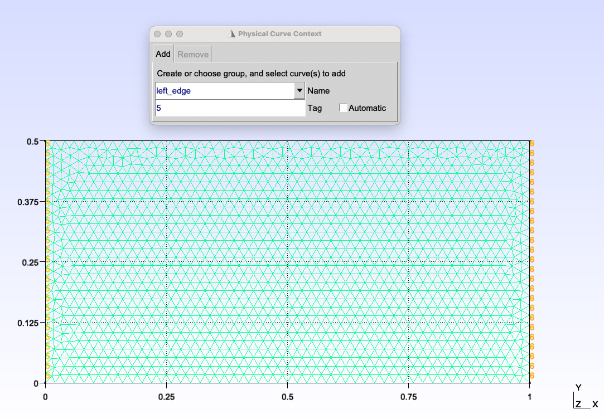

==================
Inlet operations
==================

In this section we detail the various inlet operations that can be performed using a LizzyModel object.

.. admonition:: Under the hood

    The :class:`~lizzy.bcond.bcond.BCManager` core component of the LizzyModel is responsible for all boundary conditions related operations, including inlet creation and runtime modification. The LizzyModel methods provided to the user are simply convenient wrappers around the BCManager methods.

Preparing the mesh boundaries
^^^^^^^^^^^^^^^^^^^^^^^^^^^^^^^^^^^^^^

Before we can create and assign inlets to the model, we need to ensure that the mesh we are using has named boundaries. Named boundaries are essential to identify where inlets should be assigned. When creating a mesh using GMSH, named boundaries can be created using Physical Groups. For example, in a 2D mesh, we can create a Line Physical Group and give it a name like "left_edge". This name will be used later when assigning the inlet to the mesh.

.. important::

    When using .msh format, ensure the file is exported in Version 4 ASCII, as Lizzy currently only supports this format.

Creating an inlet
^^^^^^^^^^^^^^^^^^^^^^^^^^

To create an inlet boundary condition, we use the :meth:`~lizzy.LizzyModel.create_inlet` method. This method requires two arguments: the inlet pressure (in Pa) and a unique string identifier (tag) for the inlet. For example, to create an inlet with a pressure of 1e5 Pa and the tag "inlet_1", we would write:

.. code-block::

    model.create_inlet(1e5, "inlet_1")

Once that method is called, an :class:`~lizzy.bcond.Inlet` object is created and stored in the model, but it is not yet assigned to any boundary in the mesh. To assign the inlet to a specific boundary, we use the :meth:`~lizzy.LizzyModel.assign_inlet` method, providing the inlet tag that we just created and the name of the mesh boundary where we want to assign it:

.. code-block::

    model.assign_inlet("inlet_1", "left_edge")

The boundary tag must correspond to an existing named boundary in the mesh, in this case the one we have created in the GMSH example.

