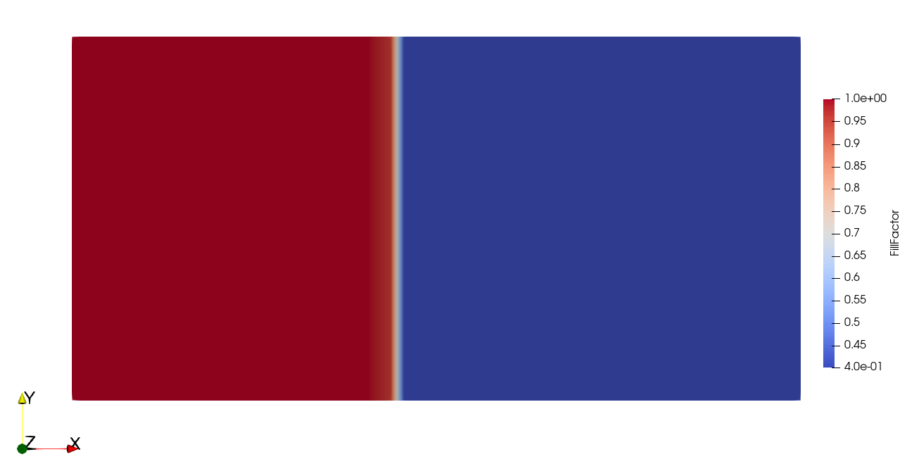
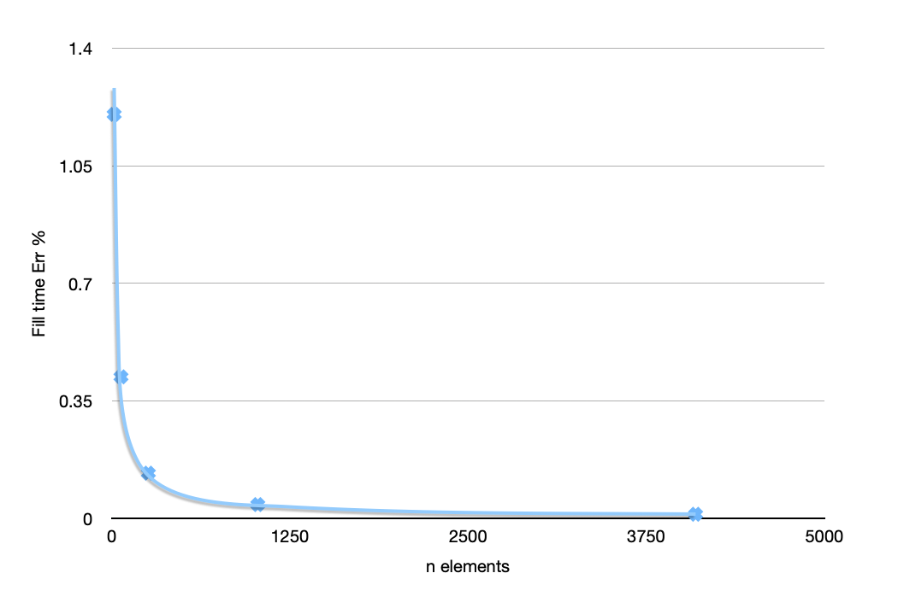
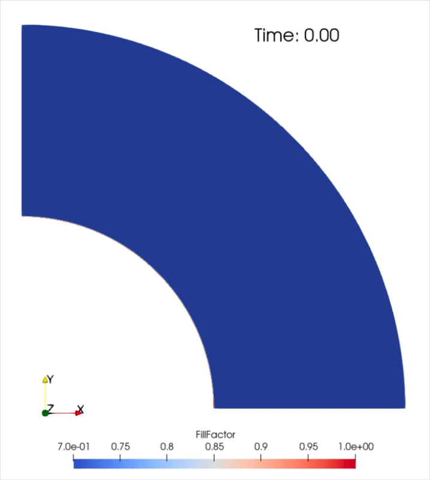

Validation
==========

We can identify some cases that have a reference solution (either analytical or established experimentally) and solve the same with Lizzy to compare results.
In the following, we present a collection of validation cases, with the aim of seeing it grow over time.

Channel flow experiment
-----------------------

The channel flow experiment, as described in the well-known work by Weitzenbock :cite:`weitzenbock1999`, has an analytical solution. For a constant inlet pressure and a perfectly one-dimensional flow, the time of arrival of the flow front at a distance L from the inlet is expressed as:

.. math::
   :label: eq_channel_flow

   t = \frac{\phi \mu L^2}{2 \Delta p \mathbf{K}}

Case definition
~~~~~~~~~~~~~~~

To conduct the channel flow experiment, we will use the following values:

- :math:`\phi` = 0.5
- :math:`\mu = 0.1` Pa·s
- :math:`\Delta p =` 1.0E+05 Pa
- :math:`\mathbf{K}` = 1.0E-10 :math:`\cdot I` m²

By plugging the values in Eq. :eq:`eq_channel_flow`, and considering a distance L = 1m, we obtain a theoretical arrival time of: :math:`t_{ref}` = **2500s** seconds. This shall be considered as the reference solution.

Lizzy solution
~~~~~~~~~~~~~~

The simulated scenario is the case that was solved in the :ref:`Channel flow experiment <channel_flow>` tutorial, with dimensions L = 1 m, W = 0.5 m.

Running the simulation with increasing number of elements we obtain the following results:

.. list-table::
   :header-rows: 1
   :align: center

   * - Number of elements
     - Fill time [s]
     - % Error
   * - 16
     - 2530.1
     - 1.20
   * - 64
     - 2510.5
     - 0.42
   * - 256
     - 2503.2
     - 0.13
   * - 1024
     - 2500.7
     - 0.03
   * - 4096
     - 2500.1
     - 0.005

As the number of elements increases, the fill time of the part approaches the theoretical solution and the error decreases.

The script and meshes to run this validation can be downloaded from `validation/channel_flow <../../../validation/channel_flow/>`_.

Radial flow experiment
----------------------

For this validation we simulate a radial infusion experiment with an isotropic material. 
In presence of constant viscosity :math:`\mu`, constant inlet pressure differential :math:`\Delta p` applied between an inner radius :math:`r_0` and the outher boundary, the time of arrival of the flow front at a radial distance :math:`r` from the center has an analytical solution :cite:`lee1989analysis`:

.. math::
   :label: eq_radial_flow

   t(r) = \frac{\mu r^2 \phi}{2 K \Delta p } \left( \ln \left( \frac{r}{r_0} \right) - \frac{1}{2} \left( 1 - \left( \frac{r_0}{r} \right)^2  \right) \right)

Case definition
~~~~~~~~~~~~~~~

To conduct the radial flow experiment, we will use the following values:

- :math:`r_0` = 1 m
- :math:`R` = 2 m
- :math:`\mu = 0.1` Pa·s
- :math:`\phi` = 0.6
- :math:`\Delta p =` 1.0E+05 Pa
- :math:`\mathbf{K}` = 1.0E-10 :math:`\cdot I` m²

By plugging the values in Eq. :eq:`eq_radial_flow`, and considering a distance :math:`r = R`, we obtain a theoretical arrival time of: :math:`t_{ref}(R)` = **3817.77** seconds (let's round up to 3818 seconds). This shall be considered as the reference solution.

We construct a set of meshes of a quarter annulus with inner radius :math:`r_0` and outer radius :math:`R`.
We can see that the flow front arrival at position :math:`r = R` happens when the part is filled. Therefore, we can directly compare the fill time of the part with the theoretical solution.

Running the simulation with increasing number of elements we obtain the following results:

.. list-table::
   :header-rows: 1
   :align: center

   * - Number of elements
     - Fill time [s]
     - % Error
   * - 30
     - 3798.13
     - 0.52
   * - 100
     - 3824.39
     - 0.17
   * - 400
     - 3822.26
     - 0.11
   * - 900
     - 3820.55
     - 0.07
   * - 1600
     - 3819.34
     - 0.04
   * - 3600
     - 3817.95
     - 0.001

   Fill simulation for N = 3600 elements
  
The script and mesh to run this validation can be downloaded from `validation/radial_flow <../../../validation/radial_flow/>`_.